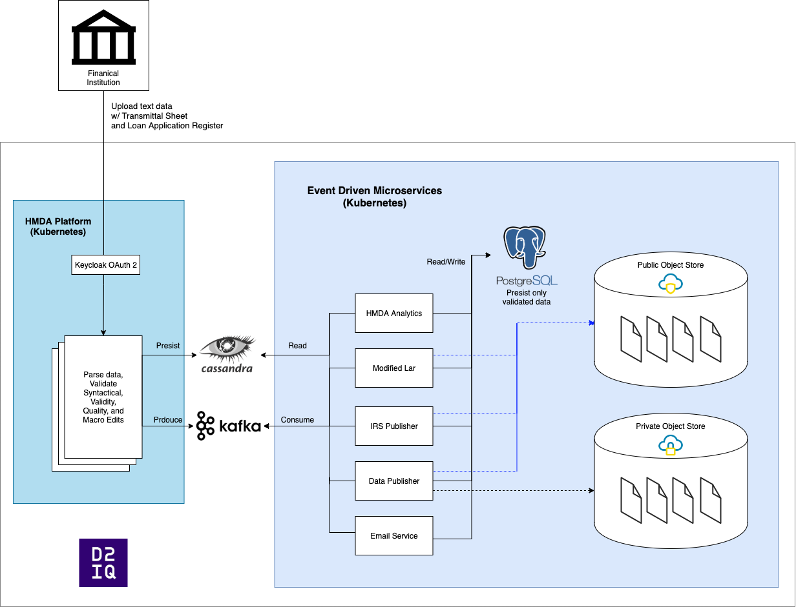

# HMDA Platform


## Introduction

The [Home Mortgage Disclosure Act (HMDA) Platform](http://ffiec.cfpb.gov/) is a [Regulatory technology](https://en.wikipedia.org/wiki/Regulatory_technology) application for financial institutions to submit mortgage information as described in the [Filing Instruction Guide (FIG)](https://s3.amazonaws.com/cfpb-hmda-public/prod/help/2020-hmda-fig.pdf). The HMDA-Platform parses data as submitted by mortgage leading institutions and validates the information for edits (Syntactical, Validity, Quality, and Macro as-per the instructions in the FIG) before submitting the data. The HMDA-Platform supports [quarterly](https://ffiec.cfpb.gov/documentation/2020/quarterly-filing-dates/) and [yearly](https://ffiec.cfpb.gov/documentation/2019/annual-filing-dates/) filing periods. For detailed information on Home Mortgage Disclosure Act (HMDA), checkout the [About HMDA page](https://www.consumerfinance.gov/policy-compliance/rulemaking/final-rules/regulation-c-home-mortgage-disclosure-act/) on the CFPB website.

[Please watch this short video](https://youtu.be/C_73Swgyc4g) to view how HMDA Platform transforms the data upload, validation, and submission process.

## Linked Projects

|  Project | Repo Link  | Description  | 
|---|---|---|
| Frontend  |  https://github.com/cfpb/hmda-frontend | ReactJS Front-end repository powering the [HMDA Platform](http://ffiec.cfpb.gov/)  
| HMDA-Help  | https://github.com/cfpb/hmda-help  | ReactJS Front-end repository powering HMDA Help - used to resolve and troubleshoot issues in filing  |   
| LARFT | https://github.com/cfpb/hmda-platform-larft  |  Repo for the [Public Facing LAR formatting tool](https://ffiec.cfpb.gov/tools/lar-formatting) |   
| HMDA Test Files  | https://github.com/cfpb/hmda-test-files  | Repo for automatically generating various different test files for HMDA Data  |   
| HMDA Census |  https://github.com/cfpb/hmda-census | ETL for geographic and Census data used by the HMDA Platform
| HMDA Data Science | https://github.com/cfpb/HMDA_Data_Science_Kit | Repo for HMDA Data science work as well as Spark codebase for [Public Facing A&D Reports](https://ffiec.cfpb.gov/data-publication/disclosure-reports/2018)

## Contents

- [TS and LAR File Specs](#ts-and-lar-file-specs)
- [End-to-End filing GIF](#end-to-end-filing-gif)
- [Technical Overview](#technical-overview)
  * [Microservices](#microservices)
- [HMDA Platform Technical Architecture](#hmda-platform-technical-architecture)
- [HMDA Data Browser Technical Architecture](#hmda-data-browser-technical-architecture)
- [Running with sbt](#running-with-sbt)
- [One-line Cloud Deployment to Dev/Prod](#one-line-cloud-deployment-to-devprod)
- [Docker Hub](#docker-hub)
- [One-line Local Development Environment (No Auth)](#one-line-local-development-environment-no-auth)
- [Automated Testing](#automated-testing)
- [Postman Collection](#postman-collection)
- [API Documentation](#api-documentation)
- [Sprint Cadence](#sprint-cadence)
- [Code Formatting](#code-formatting)
- [Development Process](#development-process)
- [Contributing](#contributing)
- [Issues](#issues)
- [Open source licensing info](#open-source-licensing-info)
- [Credits and references](#credits-and-references)

## TS and LAR File Specs

The data is submitted in a flat pipe (`|`) delimited TXT file. The text file is split into two parts: Transmission (TS) File -- first line in the file and Loan Application Register (LAR) -- all remaining lines of the file. Below are the links to the file specifications for data collected in years 2018 - current.
- [Transmission  File Spec](https://github.com/cfpb/hmda-platform/blob/master/docs/spec/Public_File_TS_Spec.csv)
- [Loan Application Register File Spec](https://github.com/cfpb/hmda-platform/blob/master/docs/spec/Public_File_LAR_Spec.csv)

## End-to-End filing GIF

The [hmda-frontend](https://github.com/cfpb/hmda-frontend) uses Cypress to test the end-to-end filing process from the end user perspective. The GIF below shows the automated filing process via Cypree - no human intervention.


## Technical Overview

This repository contains the code for the entirety of the public facing [HMDA Platform](http://ffiec.cfpb.gov/) backend. This platform has been designed to accommodate the needs of the HMDA filing process by financial institutions, as well as the data management, publication, aggregation, reporting, analyzing, visualizing, and downloading the HMDA data set.

The HMDA Platform follows a loosely coupled [event driven](https://en.wikipedia.org/wiki/Event-driven_architecture) [micro-services architecture](https://en.wikipedia.org/wiki/Microservices) with API-first [(API Documentation)](https://cfpb.github.io/hmda-platform/#hmda-api-documentation) design principles. The entire platform is built on open source frameworks and remains cloud vendor agnostic.

### Microservices

The code base contained in this repository includes the following microservices that work together in support of the HMDA Platform.

- [HMDA Platform](https://github.com/cfpb/hmda-platform/tree/master/hmda): The entire backend API for [public facing filing platform](https://ffiec.cfpb.gov/filing/2019/). Used for processing the uploaded TXT files and validating them in a non-blocking, I/O streaming way. The APIs are built to be able to process various file sizes, from small (few lines) to large (1.5M+ lines), text files simultaneously without impeding the scalability or availability of the platform. The platform contains code for customizable data edits, a [Domain Specific Language (DSL)](https://en.wikipedia.org/wiki/Domain-specific_language) for coding the data edits, and submitting events to Kafka topics.    

- [Check Digit](https://github.com/cfpb/hmda-platform/tree/master/check-digit): The entire backend API for [public facing check digit tool](https://ffiec.cfpb.gov/tools/check-digit). The Check Digit tool is used to (1) Generate a two character check-digit based on an Legal Entity Identifier (LEI) and (2) Validate that a check-digit is calculated correctly for any complete Universal Loan Identifier (ULI). This APIs are built to process multiple row CSV files as well as one time processing.

- [Institutions API](https://github.com/cfpb/hmda-platform/tree/master/institutions-api): Read only API for fetching details about an LEI. This microservice also listens to events put on the `institutions-api` Kafka topic for Creating, updating, and deleting institution data from PostgreSQL.

- [Data Publisher](https://github.com/cfpb/hmda-platform/tree/master/hmda-data-publisher): This microservice runs on a scheduled basis to make internal / external data available for research purposes via object stores such as S3. The schedule for the job is configurable via [K8s config map](https://github.com/cfpb/hmda-platform/blob/master/kubernetes/config-maps/schedule-configmap.yaml)

- [Ratespread](https://github.com/cfpb/hmda-platform/tree/master/ratespread-calculator): Public facing API for the [ratespread calculator](https://ffiec.cfpb.gov/tools/rate-spread). This calculator provides rate spreads for HMDA reportable loans with a final action date on or after January 1st, 2018. This API supports streaming CSV uploads as well as one-time calculations.

- [Modified LAR](https://github.com/cfpb/hmda-platform/tree/master/modified-lar): Event driven service of [modified-lar reports](https://ffiec.cfpb.gov/data-publication/modified-lar/2019). Each time a filer successfully submits the data, the modified-lar micro-service generates a modified-lar report and puts it in the public object store (e.g. S3). Any re-submissions automatically re-generate new modified-lar reports.

- [IRS Publisher](https://github.com/cfpb/hmda-platform/tree/master/irs-publisher): Event driven service of [irs-disclosure-reports](https://ffiec.cfpb.gov/data-publication/disclosure-reports/). Each time a filer successfully submits the data, the irs-publisher microservice generates the IRS report.

- [HMDA Reporting](https://github.com/cfpb/hmda-platform/tree/master/hmda-reporting): Real-time, public facing API for getting information (LEI number, institution name, and year) on LEIs who have successfully submitted their data.

- [HMDA Analytics](https://github.com/cfpb/hmda-platform/tree/master/hmda-analytics): Event driven service to insert, delete, update information in PostgreSQL each time there is a successful submission. The data inserted maps with the Census data to provide information for MSAMds. It also adds race, sex, and ethnicity categorization to the data.

- [HMDA Dashboard](https://github.com/cfpb/hmda-platform/tree/master/hmda-dashboard): Authenticated APIs to view realtime analytics for the filings happening on the platform. The dashboard includes summarized statistics, data trends, and supports data visualizations via frontend.

- [Rate imit](https://github.com/cfpb/hmda-platform/tree/master/rate-limit): Rate limiter service working in-sync with [ambassador](https://www.getambassador.io/docs/latest/topics/running/services/rate-limit-service/) to limit the number of times in a given time period that the API can be called. If the rate limit is reached, a 503 error code is sent.

- [HMDA Data Browser](https://github.com/cfpb/hmda-platform/tree/master/data-browser): Public facing API for [HMDA Data Browser](https://ffiec.cfpb.gov/data-browser/). This API makes the entire dataset available for summarized statistics, deep analysis, as well as geographic map layout.

- [Email Service](https://github.com/cfpb/hmda-platform/tree/master/email-service): Event driven service to send an automated email to the filer on each successful submission.


## HMDA Platform Technical Architecture

The image below shows the cloud vendor agnostic technical architecture for the HMDA Platform.

<a href="diagrams/hmda_platform_diagram.png"></a>

## HMDA Data Browser Technical Architecture

<a href="data-browser/README.md">Please view the README for HMDA Data Browser</a>

## Installations
Before running the HMDA Platform, make sure to have the following installed:

### MacOS
1. Install [Homebrew](https://brew.sh/):
    ```bash
    /bin/bash -c "$(curl -fsSL https://raw.githubusercontent.com/Homebrew/install/HEAD/install.sh)"
    ```
2. Install [Docker](https://www.docker.com/):
    ```bash
    brew install docker
    ```
3. Install one of following docker engine implementations:
    * [Docker Desktop](https://docs.docker.com/desktop/install/mac-install/)
    * [Podman](https://podman.io/)
    * [Colima](https://github.com/abiosoft/colima/)
    * [Rancher Desktop](https://rancherdesktop.io/)
4. Go to the following link for instructions to install OpenJDK:
    * [Java (version 13.0.2) for MacOS](/docs/JavaInstall.md)
5. Install Scala (version 2.12 for compatibility issues):
    ```bash 
    brew install scala@2.12
    ```
6. Install [sdkman](https://sdkman.io/install):
    ```bash
    curl -s "https://get.sdkman.io" | bash
    ```
7. Install [sbt](https://www.scala-sbt.org/) using `sdkman` (not `brew`):
    ```bash
    sdk install sbt <VERSION>
    ```
    * Replace `<VERSION>` with the version used in `project/build.properties` or higher

8. Clone the repo and go into the repo directory:
    ```bash
    git clone https://github.com/cfpb/hmda-platform.git
    cd hmda-platform
    ```

### Apple Silicon

The current platform and specifically Cassandra have problems running on "Apple silicon" architecture. If your laptop **About This Mac** information shows an Apple M1 or later chip, this applies to you. This will cause test suites to abort.

The current solution is to install, build and run with an amd64-compatible JDK.

```bash
brew install asdf
arch -x86_64 asdf plugin-add java https://github.com/halcyon/asdf-java.git
arch -x86_64 asdf install java openjdk-13.0.2
export JAVA_HOME=$HOME/.asdf/installs/java/openjdk-13.0.2
```

## Running Locally

### Running with sbt

The HMDA Platform can run locally using [`sbt`](https://www.scala-sbt.org/) with an [embedded Cassandra](https://doc.akka.io/docs/alpakka-kafka/current/) and [embedded Kafka](https://doc.akka.io/docs/alpakka-kafka/current/). To get started:

1. Export the following environment variables:
    ```bash
    export CASSANDRA_CLUSTER_HOSTS=localhost
    export APP_PORT=2551
    ```
2. Open terminal with `hmda-platform` root as the  working directory
3. Start sbt and run the platform with the following commands:
    ```bash
    sbt
    [...]
    sbt:hmda-root> project hmda-platform
    sbt:hmda-platform> reStart
    ```

### Running with docker compose

The platform and it's dependency services, Kafka, Cassandra and PostgreSQL, can run locally using [Docker Compose](https://docs.docker.com/compose/).
The entire filing plaform can be spun up using a one line command. Using this locally running instance of Platform One, no authentication is needed. 

```bash
# Bring up every service (e.g., "hmda-platform", "hmda-analytics", "institutions-api")
docker compose up

# Bring up a single service (e.g., "hmda-platform")
docker compose up hmda-platform
```

Additionally, there are several environment varialbes that can be configured/changed. The platform uses sensible defaults for each one. However, if required they can be overridden:

```bash
CASSANDRA_CLUSTER_HOSTS
CASSANDRA_CLUSTER_DC
CASSANDRA_CLUSTER_USERNAME
CASSANDRA_CLUSTER_PASSWORD
CASSANDRA_JOURNAL_KEYSPACE
CASSANDRA_SNAPSHOT_KEYSPACE
KAFKA_CLUSTER_HOSTS
APP_PORT
HMDA_HTTP_PORT
HMDA_HTTP_ADMIN_PORT
HMDA_HTTP_PUBLIC_PORT
MANAGEMENT_PORT
HMDA_CASSANDRA_LOCAL_PORT
HMDA_LOCAL_KAFKA_PORT
HMDA_LOCAL_ZK_PORT
WS_PORT
```

### Access locally built platform APIs
The following API endpoints are accessible when running the platform locally using either [Running with sbt](#running-with-sbt) or [Running with docker compose](#running-with-docker-compose).
* [hmda-admin-api](http://localhost:8081)   
* [hmda-filing-api](http://localhost:8080)   
* [hmda-public-api](http://localhost:8082)   

## Build hmda-platform Docker image

Docker Image is build via Docker plugin utilizing [sbt-native-packager](https://sbt-native-packager.readthedocs.io/en/stable/formats/docker.html#docker-plugin)

```
sbt -batch clean hmda-platform/docker:publishLocal
```

The image can be built without running tests using:

```
sbt "project hmda-platform" dockerPublishLocalSkipTests
```

## One-line Cloud Deployment to Dev/Prod

The platform and all of the related microservices explained above are deployed on [Kubernetes](https://kubernetes.io/) using [Helm](https://helm.sh/). Each deployment is a single Helm command. Below is an example for the deployment of the email-service:

```shell
helm upgrade --install --force \                            
--namespace=default \
--values=kubernetes/hmda-platform/values.yaml \
--set image.repository=hmda/hmda-platform \
--set image.tag=<tag name> \
--set image.pullPolicy=Always \
hmda-platform \
kubernetes/hmda-platform
```

## Docker Hub

All of the containers built by the HMDA Platform are released publicly via Docker Hub: https://hub.docker.com/u/hmda

## Automated Testing

The HMDA Platform takes a rigorous automated testing approach. In addtion to Travis and CodeCov, we've prepared a suite of [Newman](https://github.com/cfpb/hmda-platform/tree/master/newman) test scripts that perform end-to-end testing of the APIs on a recurring basis. The testing process for Newman is containerized and runs as a Kubernetes CronJob to act as a monitoring and alerting system. The platform and microservices are also testing for load by using [Locust](https://locust.io/).

## Postman Collection

In addition to using Newman for our internal testing, we've created a [HMDA Postman](https://github.com/cfpb/hmda-platform/tree/master/newman/postman) collection that makes it easier for  users to perform a end-to-end filing of HMDA Data, including upload, parsing data, flagging edits, resolving edits, and submitting data when S/V edits are resolved.

## API Documentation

The [HMDA Platform Public API Documentation](https://cfpb.github.io/hmda-platform/#hmda-api-documentation) is hosted in the [HMDA Platform API Docs repo](https://github.com/cfpb/hmda-platform-api-docs) and deployed to GitHub Pages using the [`gh-pages`](https://github.com/cfpb/hmda-platform/tree/gh-pages) branch.


## Sprint Cadence

Our team works in two week sprints. The sprints are managed as [Project Boards](https://github.com/cfpb/hmda-platform/projects). The backlog grooming happens every two weeks as part of Sprint Planning and Sprint Retrospectives.

## Code Formatting

Our team uses [Scalafmt](https://scalameta.org/scalafmt/) to format our codebase. 

## Development Process

Below are the steps the development team follows to fix issues, develop new features, etc.

1. Create a fork of this repository
2. Work in a branch of the fork
3. Create a PR to merge into master
4. The PR is automatically built, tested, and linted using: Travis, Snyk, and CodeCov
5. Manual review is performed in addition to ensuring the above automatic scans are positive
6. The PR is deployed to development servers to be checked using Newman
7. The PR is merged only by a separate member in the dev team

## Contributing

[`CFPB`](https://www.consumerfinance.gov/) is developing the `HMDA Platform` in the open to maximize transparency and encourage third party contributions. If you want to contribute, please read and abide by the terms of the [License](LICENSE) for this project. [Pull Requests](https://help.github.com/articles/using-pull-requests/) are always welcome.

## Issues

We use GitHub issues in this repository to track features, bugs, and enhancements to the software.

## Open source licensing info
1. [TERMS](TERMS.md)
2. [LICENSE](LICENSE)
3. [CFPB Source Code Policy](https://github.com/cfpb/source-code-policy/)

## Credits and references

Related projects
  - https://github.com/cfpb/hmda-combined-documentation - ReactJS Front-end with intergration DocSearch program repository powering the [HMDA Platform](http://ffiec.cfpb.gov/)
  - https://github.com/cfpb/hmda-platform-larft - Repo for the [Public Facing LAR formatting tool](https://ffiec.cfpb.gov/tools/lar-formatting)
  - https://github.com/cfpb/hmda-test-files - Repo for automatically generating various different test files for HMDA Data
  - https://github.com/cfpb/hmda-census - ETL for geographic and Census data used by the HMDA Platform
  - https://github.com/cfpb/HMDA_Data_Science_Kit - Repo for HMDA Data science work as well as Spark codebase for [Public Facing A&D Reports](https://ffiec.cfpb.gov/data-publication/disclosure-reports/2018)
