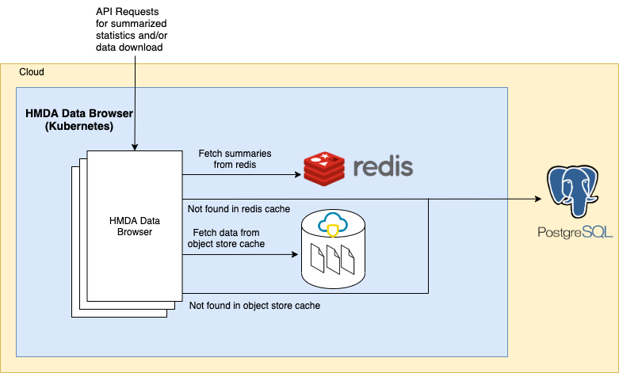

## Introduction

The Home Mortgage Disclosure Act (HMDA) Platform is a [Regulatory technology](https://en.wikipedia.org/wiki/Regulatory_technology) application for financial institutions to submit mortgage information as described in the [Filing Instruction Guide (FIG)](https://s3.amazonaws.com/cfpb-hmda-public/prod/help/2020-hmda-fig.pdf). The HMDA-Platform parses data as submitted by mortgage leading institutions and validates the information for edits (Syntactical, Validity, Quality, and Macro as-per the instructions in the FIG) before submitting the data. The HMDA-Platform supports [quarterly](https://ffiec.cfpb.gov/documentation/2020/quarterly-filing-dates/) and [yearly](https://ffiec.cfpb.gov/documentation/2019/annual-filing-dates/) filing periods. For detailed information on Home Mortgage Disclosure Act (HMDA), checkout the [About HMDA page](https://www.consumerfinance.gov/policy-compliance/rulemaking/final-rules/regulation-c-home-mortgage-disclosure-act/) on the CFPB website.

The [HMDA Data Browser](https://ffiec.cfpb.gov/data-browser/) (Public Facing) allows users to filter, analyze, and download HMDA datasets and visualize data through charts, graphs, and maps.

## Technical Architecture

The image below shows the cloud vendor agnostic technical architecture for the HMDA Data Browser.

The multi-year data is stored in PostgreSQL and cached in Redis + Object Stores. The first time the user accesses the data, the cache is searched. If the data is found it the cache, it is served. However, if the data isn't found in the cache, the cache is updated and then the data is served so that the next time the data would be served from the cache. 

<a href="../diagrams/hmda_data_browser.png"></a>

## API Documentation

The API documentation for the data-browser is available publicly. https://cfpb.github.io/hmda-platform/#data-browser-api 

## Redis Keys

Redis keys are supported for multiple years. Below is an example of redis key with states VA and MD and total_units 4 for year 2018 and 2019

```
GET 'AGG:state:VA|ME:total_units:4:year:2018'
GET 'AGG:state:VA|ME:total_units:4:year:2019'
```